# 🌌 A.R.I.A. Platform — Comprehensive Project Report

> **A.R.I.A.** — **Autonomous Reasoning & Intelligent Assembly**
> *"The Cursor for the Physical World"*

---

## 1. What Is A.R.I.A.?

A.R.I.A. is a **Hardware-Aware AI Operating System** — a first-of-its-kind platform that brings the AI-powered code-editing paradigm (think Cursor, GitHub Copilot) into the **physical world** of electronics and hardware engineering. Built for the **Google DeepMind Gemini API Developer Competition 2025** (Vibe Engineering track), it transforms any camera into an intelligent engineering assistant that can **See**, **Reason**, **Act**, and **Verify** physical hardware tasks.

### The Core Problem It Solves

Hardware debugging is fundamentally different from software debugging. When a circuit doesn't work, engineers must:
- Trace physical wires across breadboards
- Cross-reference datasheets for component specifications
- Mentally map code pin definitions to physical connections
- Iterate through compile → flash → test cycles manually

**A.R.I.A. closes this gap** by creating an AI that understands *both* the code in your editor *and* the physical hardware on your desk — simultaneously.

### The One-Line Pitch

> A self-healing hardware development environment powered by Gemini 3.0 that sees your workspace through a camera, reasons about circuits using a "Council of Hardware Experts", autonomously flashes firmware, and visually verifies the result.

---

## 2. System Architecture

### 2.1 High-Level Architecture

The platform follows a **layered architecture** with three delivery surfaces feeding into a shared core engine:

```mermaid
graph TD
    subgraph Delivery Layer
        A["🖥️ VS Code Extension<br/>(TypeScript, 31 files)"]
        B["🐍 Desktop Agent<br/>(Python + Flet)"]
        C["📱 Mobile PWA<br/>(Vite + React, planned)"]
    end

    subgraph Core Engine
        D["🧠 GeminiCoordinator<br/>Multi-Agent Orchestrator"]
        E["👁️ VisionLink<br/>Camera + OpenCV"]
        F["🔌 HardwareLink<br/>Serial + PlatformIO"]
    end

    subgraph AI Backend
        G["Gemini 3.0 Pro<br/>Complex Reasoning, 1M tokens"]
        H["Gemini 3.0 Flash<br/>Real-time Actions, <1s latency"]
    end

    A --> D
    B --> D
    C --> D
    D --> G
    D --> H
    D --> E
    D --> F
```



### 2.2 The Two Incarnations

The project evolved through **two major phases**:

| Phase | Technology | Location | Status |
|-------|-----------|----------|--------|
| **V1 (Legacy)** | Python + Flet desktop app | `_legacy_v1/` | Archived |
| **V2 (Current)** | VS Code Extension (TypeScript) | `aria-vscode/` | Active |

**V1** was a standalone desktop application using Python's Flet framework (Flutter-based UI) with OpenCV camera integration, a file explorer, code editor, and AI chat panel. It demonstrated the core concept but lacked the deep IDE integration needed for a professional workflow.

**V2** pivoted to a **VS Code extension**, embedding A.R.I.A. directly into the developer's existing workflow. This was the right call — it leverages VS Code's massive ecosystem, file management, terminal, and gives A.R.I.A. native access to the editor's document model.

---

## 3. Component Deep Dive

### 3.1 VS Code Extension — The Primary Interface

**Location**: `aria-vscode/src/`
**Language**: TypeScript | **31 source files** across **13 modules**

#### Module Map

| Module | Files | Purpose |
|--------|-------|---------|
| `ai/` | `geminiClient.ts` (1430 lines), `types.ts` | Gemini API wrapper — the brain |
| `panels/` | `ariaPanel.ts` (1496 lines), `cameraPanel.ts` | Main UI, Webview rendering |
| `commands/` | 13 files (index, analyze*, build, capture, etc.) | All VS Code command handlers |
| `vision/` | `cameraBridge.ts` (394 lines), `visionClient.ts` | Camera integration & hardware recognition |
| `firmware/` | `platformioManager.ts` (328 lines) | Build, flash, port management |
| `serial/` | `serialManager.ts` (128 lines) | Serial monitor integration |
| `hardware/` | `validator.ts` (155 lines) | Heuristic hardware validation |
| `context/` | `hardwareContext.ts` (152 lines) | `platformio.ini` parser |
| `simulation/` | `wokwiGenerator.ts` (332 lines) | Wokwi circuit simulation |
| `chat/` | `chatManager.ts` (183 lines) | Session/history persistence |
| `utils/` | `diffEngine.ts`, `logger.ts`, `editorContext.ts`, `patchedContentProvider.ts` | Diff patching, logging, editor tracking |

---

### 3.2 `GeminiClient` — The Brain (1430 lines)

**File**: `aria-vscode/src/ai/geminiClient.ts`

This is the **largest and most critical file** in the entire codebase. It's a static class that wraps every interaction with the Gemini API. It contains **28 methods** covering:

| Capability | Methods |
|-----------|---------|
| **Code Analysis** | `analyzeCode()`, `_internalAnalyze()`, `analyzeProject()` |
| **AI Chat** | `chat()`, `chatWithImage()` |
| **Vision** | `analyzeImage()`, `analyzeVideo()`, `uploadFile()`, `waitForFileActive()` |
| **Build Repair** | `fixBuildError()` |
| **Serial Intelligence** | `analyzeSerialLogs()`, `parseSerialResponse()` |
| **Generative Content** | `generateVideoScript()`, `generateImage()`, `generateSchematicSVG()` |
| **Response Parsing** | `parseMarkdownResponse()`, `extractJson()`, `extractJsonAndThoughts()`, `findBalancedJson()` |
| **Infrastructure** | `callGemini()`, `constructPrompt()`, `logAvailableModels()`, `listAvailableModels()`, `mockAnalysis()` |

#### Dual-Model Routing Strategy

```
┌───────────────────────────────────────────┐
│  User Query / Action                       │
└───────────────┬───────────────────────────┘
                │
    ┌───────────▼───────────┐
    │  Is this complex?     │
    │  (multi-file analysis,│
    │   deep reasoning)     │
    └───┬───────────────┬───┘
        │ YES           │ NO
        ▼               ▼
┌───────────────┐ ┌───────────────┐
│ Gemini 3.0    │ │ Gemini 3.0    │
│ Pro           │ │ Flash         │
│ • 1M tokens   │ │ • <1s latency │
│ • Deep reason │ │ • Quick fixes │
│ • Multi-file  │ │ • Serial parse│
└───────────────┘ └───────────────┘
```

Supported models (with automatic fallback):
- `gemini-3-flash-preview` (default)
- `gemini-3-pro-preview`
- `gemini-2.5-flash`
- `gemini-2.0-flash-lite-preview-02-05`
- `gemini-2.0-flash`
- `gemini-2.0-flash-001`

---

### 3.3 `AriaPanel` — The UI Engine (1496 lines)

**File**: `aria-vscode/src/panels/ariaPanel.ts`

The main VS Code **Webview Panel** — this is the user's primary interaction surface. It renders as a sidebar within VS Code containing the chat interface, analysis results, and action buttons.

#### Key Capabilities

| Feature | Method(s) |
|---------|-----------|
| **Slash Command Router** | `_handleCommand()` — parses `/analyze`, `/fix`, `/build`, `/flash`, `/simulate`, `/explain`, `/schematic`, `/serial`, `/init`, and more |
| **Smart Diff View** | `_handlePreviewDiff()`, `_handleApplyDiff()`, `_applyDiff()` — shows unified diffs with Preview/Apply buttons |
| **Bulk Auto-Fix** | `_handleApplyAllUntilClean()` — applies all AI-suggested fixes, rebuilds, re-analyzes in a loop until build passes |
| **Simulation** | `_handleGenerateSimulation()`, `_handleOpenSimulation()` — generates Wokwi configs and launches browser simulation |
| **Vision Pipeline** | `analyzeImage()`, `startVideoCapture()`, `processVideo()` — hardware recognition from camera/video |
| **Explain Animations** | `_handleExplainCommand()` — generates self-contained HTML5/SVG animations for engineering concepts |
| **Image Generation** | `_handleGenerateImage()` — generates images via Gemini's image generation |
| **Project Init** | `_handleInitProject()` — scaffolds PlatformIO projects from natural language board names |

---

### 3.4 Hardware Context Awareness

**File**: `aria-vscode/src/context/hardwareContext.ts`

This is what makes ARIA *hardware-aware* rather than just another AI chatbot. The `HardwareContext` class:

1. **Scans the workspace** for all `platformio.ini` files
2. **Parses each config** to extract: board type, framework, libraries, environments
3. **Generates a structured summary** that's injected into every AI prompt

```
Example output:
HARDWARE CONTEXT (PlatformIO):
- Config: platformio.ini
  Target: nanoatmega328 (Framework: arduino)
  Libraries: Servo, AccelStepper, Wire
```

This context is what enables ARIA to say *"You're using Pin 13, but on the ESP32, the built-in LED is GPIO 2"* — it knows your specific board.

---

### 3.5 Camera & Vision System

**Files**: `aria-vscode/src/vision/cameraBridge.ts`, `aria-vscode/src/vision/visionClient.ts`

The vision system supports **four capture modes**, evolved through real-world testing:

| Mode | How It Works | When Used |
|------|-------------|-----------|
| **Python Native** | Spawns `camera_server.py`, captures via OpenCV, streams MJPEG to localhost | Pro mode, headless |
| **External Browser** | Opens minimal browser page that captures `getUserMedia` and POSTs frames to local server | When Webview blocks camera |
| **Stream Mode** | MJPEG streaming from external driver to embedded Webview via `` tag | Fallback |
| **Image File** | User selects a saved image/photo manually | No camera available |

The `VisionClient` sends captured images to Gemini with a strict system prompt:
- Identifies boards (Arduino, ESP32, Raspberry Pi) and components (sensors, servos, LEDs)
- Returns structured JSON with confidence scores and disclaimers
- **Conservative by design**: Will not infer wiring correctness from images alone

---

### 3.6 Build & Flash Pipeline

**File**: `aria-vscode/src/firmware/platformioManager.ts`

A comprehensive **PlatformIO CLI wrapper** that manages the entire firmware lifecycle:

```mermaid
flowchart LR
    A[User clicks Build] --> B{PIO project\nexists?}
    B -->|No| C[Init with board ID]
    B -->|Yes| D[pio run]
    C --> D
    D -->|Success| E[✅ Build OK]
    D -->|Fail| F[Auto-Fix Loop]
    F --> G[AI analyzes error]
    G --> H[Suggests diff]
    H --> I[User applies fix]
    I --> D
    E --> J{Flash?}
    J -->|Yes| K[Safety Interlocks]
    K --> L[pio run -t upload]
    L --> M[✅ Firmware Uploaded]
```



#### Board Resolution (Natural Language → PlatformIO ID)

The manager includes a **24-entry alias map** for common board names plus **AI fallback**:

```
"arduino nano" → "nanoatmega328"
"esp32"        → "esp32dev"
"teensy 4.1"   → "teensy41"
"pico"         → "pico"
```

If the alias map doesn't match, it falls back to Gemini to resolve unknown board names.

#### Safety Interlocks (Before Flashing)

1. **Hardware Validation** — static code analysis for pin conflicts, out-of-bounds pins
2. **Board Mismatch Detection** — compares `platformio.ini` board against vision-detected board
3. **Port Auto-Detection** — lists USB serial ports, auto-selects if only one found
4. **Explicit User Confirmation** — modal dialog: *"This will flash firmware to COM3. Continue?"*

---

### 3.7 Hardware Validator

**File**: `aria-vscode/src/hardware/validator.ts`

A **heuristic-based static analyzer** that catches hardware-specific bugs at edit time:

| Check | What It Catches |
|-------|----------------|
| **Duplicate Pin Assignment** | Two `#define` or `const int` mapping to the same pin number |
| **Servo Angle Out of Bounds** | `.write(200)` — servo angles must be 0–180 |
| **Board-Specific Pin Limits** | Teensy 4.1 only has pins 0–55 |
| **Motor Pattern Detection** | Detects H-bridge patterns (L298N, L293D), PWM + direction control |
| **Vision Cross-Check** | Compares detected physical components against code references |
| **Board Mismatch** | Vision sees "Arduino Uno" but config says "ESP32" |

Returns: `pass` | `warning` | `fail` plus issues, recommendations, pin usage map, and detected peripherals.

---

### 3.8 Wokwi Simulation Generator

**File**: `aria-vscode/src/simulation/wokwiGenerator.ts`

When hardware isn't available, ARIA creates a **Digital Twin**. The generator:

1. Maps PlatformIO board IDs to Wokwi component types (e.g., `nanoatmega328` → `wokwi-arduino-nano`)
2. Reads the `HardwareValidationResult` to extract detected peripherals (servo, stepper, DC motor, etc.)
3. Generates a complete `diagram.json` with parts, positions, and wire connections
4. Creates `wokwi.toml` configuration file
5. Launches the simulation in the browser

Supports **16 board mappings** across Arduino AVR, ESP32, STM32, and Teensy families.

---

### 3.9 Serial Intelligence

**File**: `aria-vscode/src/serial/serialManager.ts`

The serial monitor wraps PlatformIO's `pio device monitor` with:
- **Timestamped logging** to a VS Code Output Channel
- **500-line rolling buffer** for AI context
- **Event-driven architecture** (fires `onLogReceived` for UI updates)
- AI-powered **crash dump analysis**: stack traces, HardFaults, register dumps (CFSR, HFSR)

---

### 3.10 Smart Diff Engine

**File**: `aria-vscode/src/utils/diffEngine.ts`

Applies **unified diffs** generated by the AI to actual source files. This is critical for the *"Suggest → Preview → Apply"* workflow. Includes:
- Diff validation (`_isValidUnifiedDiff`)
- Diff sanitization (`_sanitizeUnifiedDiff`)
- Safe application (`_isSafeToApply`)
- VS Code native diff view via `PatchedContentProvider`

---

### 3.11 Python Core Engine

**File**: `src/core/coordinator.py`

The Python-side brain, used by the legacy desktop agent. The `GeminiCoordinator` class (449 lines) implements:

| Feature | Description |
|---------|-------------|
| **Dual-Model Routing** | Routes queries to Pro (complex) or Flash (fast) based on smart analysis |
| **Thought Streaming** | Secondary "Cortex narrator" agent that explains the AI's reasoning in real-time for the Thought Stream UI panel |
| **Quota Management** | Tracks API usage, warns at 70%/90% thresholds, implements exponential backoff |
| **Retry Logic** | Intelligent retry with backoff for 429/quota errors |
| **Conversation History** | Maintains chat context across queries |

---

## 4. The "Council of Hardware Experts" — Multi-Agent Design

### 4.1 Architecture

Rather than using a single generic AI, ARIA employs **specialized AI personas** that collaborate:

| Expert | Role | Personality |
|--------|------|-------------|
| 🔌 **Electronics Engineer** | Circuit analysis, firmware debugging, component recommendations | Methodical, precise terminology, datasheet-citing |
| 🔧 **Mechanical Engineer** | Physical assembly, structural analysis, fastener specifications | Practical, hands-on, safety-conscious |

### 4.2 Prompt Engineering

The electronics engineer persona is defined in `prompts/electronics_engineer.md` with:
- **15+ years embedded systems experience** as system instruction
- **Specific expertise**: power rail tracing, pull-up/down resistors, crash dump decoding
- **Tool access**: `search_datasheet`, `read_serial`, `flash_firmware`, `annotate_image`
- **Output format**: Structured JSON for annotations, numbered debugging steps

### 4.3 Council Consensus Flow

```
User Query → Both Experts Analyze → Each Provides Assessment →
Synthesize Consensus → Present Unified Recommendation + AR Overlays
```

---

## 5. The Autonomous Verification Loop

This is the **core innovation** — the Sense → Reason → Act → Verify loop:

```mermaid
flowchart TD
    A[1. SENSE — Camera captures workspace] --> B[2. REASON — Council analyzes scene]
    B --> C[3. PLAN — Generate code & wiring fixes]
    C --> D[4. ACT — Flash firmware via PlatformIO]
    D --> E[5. OBSERVE — Read serial + watch video]
    E --> F{6. VERIFY — Did it work?}
    F -->|✅ Yes| G[Task Complete]
    F -->|❌ No| B
```



**Concrete example**: User says *"Make the LED blink"*
1. Camera detects Arduino Uno, LED on pin 13
2. AI generates blink sketch
3. PlatformIO compiles and flashes
4. Serial monitor confirms "Setup complete", video shows LED toggling
5. ARIA reports: *"✅ LED is blinking correctly!"*

If verification fails, the loop returns to REASON with error context attached.

---

## 6. Registered VS Code Commands

All 14 commands registered in `aria-vscode/src/commands/index.ts`:

| Command | Handler | Description |
|---------|---------|-------------|
| `aria.openPanel` | `openPanel` | Opens the ARIA Copilot side panel |
| `aria.analyzeSelection` | `analyzeSelection` | AI analyzes highlighted code |
| `aria.analyzeFile` | `analyzeFile` | AI analyzes the entire active file |
| `aria.analyzeWorkspace` | `analyzeWorkspace` | Deep scan of up to 50 workspace files |
| `aria.validateHardware` | `validateHardware` | Static hardware validation |
| `aria.captureImage` | `captureImage` | Capture from camera for vision analysis |
| `aria.captureVideo` | `captureVideo` | Record video for temporal analysis |
| `aria.setApiKey` | `setApiKey` | Configure Gemini API key |
| `aria.buildAndFlash` | `buildAndFlash` | Build or flash firmware |
| `aria.buildFirmware` | `runBuild` | Build only |
| `aria.flashFirmware` | `runFlash` | Flash only (with safety interlocks) |
| `aria.openSerialMonitor` | `openSerialMonitorCommand` | Start serial monitoring session |
| `aria.analyzeSerialLogs` | `analyzeSerialLogsCommand` | AI-powered serial log analysis |
| `aria.analyzeTerminal` | `analyzeTerminalCommand` | Analyze terminal output with AI |

---

## 7. Slash Command System

The chat panel supports rich slash commands parsed in `_handleCommand()`:

| Command | Action |
|---------|--------|
| `/analyze` | Analyze current file or selection |
| `/fix` | Auto-fix errors in code |
| `/build` | Compile firmware |
| `/flash` | Flash to connected device |
| `/simulate` | Generate Wokwi digital twin |
| `/explain [topic]` | Generate HTML5/SVG animation explaining a concept |
| `/schematic [description]` | Generate circuit schematic SVG from code + platformio.ini |
| `/serial` | Open/analyze serial monitor |
| `/init [board]` | Initialize PlatformIO project |
| `/refactor` | Improve code structure |
| `/test` | Generate unit tests |

---

## 8. Legacy V1 — The Original Vision

**Location**: `_legacy_v1/`

The legacy codebase reveals the project's **robotics origin**: A.R.I.A. was originally built as a **robotic arm controller** with:

| Component | Description |
|-----------|-------------|
| **Teensy 4.1 Firmware** | Hybrid stepper + servo arm controller (6-axis: base stepper, 4 servo joints, gripper) |
| **Calibration Firmware** | Forces all servos to 90° for horn alignment |
| **ESP32 Voice Interface** | Voice command capabilities |
| **Pi5 Coordinator** | Raspberry Pi 5 as central coordinator (16 files) |
| **PCB Schematics** | Custom PCB designs for the arm |
| **3D Models** | Mechanical parts for the arm structure |
| **Desktop Apps** | Multiple iterations: `aria_desktop.py`, `aria_desktop_v1.py`, `aria_desktop_editor.py`, `aria_desktop_ide.py` |

The legacy desktop app (`aria_desktop.py`) was built with:
- **Flet** framework (Flutter-based Python UI)
- **OpenCV** for camera integration
- **Glassmorphic dark theme** with JetBrains Mono font
- File Explorer, Editor Workspace, Vision Panel, and Copilot Chat

---

## 9. Technology Stack Summary


| Layer | Technology |
|-------|-----------|
| **IDE Integration** | VS Code Extension API, Webview |
| **Primary Language** | TypeScript (extension), Python (core engine, camera) |
| **AI Backend** | Google Gemini 3.0 Pro + Flash (REST API) |
| **Firmware Toolchain** | PlatformIO CLI |
| **Computer Vision** | OpenCV (Python), WebRTC (browser) |
| **Simulation** | Wokwi |
| **Serial** | PlatformIO Device Monitor |
| **Desktop UI (Legacy)** | Python Flet |

---

## 10. Codebase Statistics

| Metric | Value |
|--------|-------|
| **Total VS Code Extension files** | 31 TypeScript source files |
| **Largest file** | `ariaPanel.ts` — 1,496 lines |
| **Second largest** | `geminiClient.ts` — 1,430 lines |
| **Total VS Code extension LOC** | ~6,000+ lines |
| **Python core** | `coordinator.py` — 449 lines |
| **Legacy codebase** | 57 files across firmware, hardware, software, docs |
| **Registered commands** | 14 VS Code commands |
| **Slash commands** | 11+ chat commands |
| **Gemini model support** | 6 models with automatic fallback |
| **Board mappings** | 16 PlatformIO → Wokwi board maps |
| **Camera capture modes** | 4 modes |

---

## 11. Key Design Decisions

| Decision | Why |
|----------|-----|
| **VS Code Extension over standalone app** | Leverages existing IDE ecosystem, avoids reinventing file management/terminal |
| **Static class architecture** | All major services (`GeminiClient`, `HardwareContext`, `PlatformIOManager`, `SerialManager`) are static singletons — simple, stateless, no DI needed |
| **Dual Gemini models** | Pro for deep reasoning (multi-file analysis), Flash for speed (chat, serial parsing) |
| **Conservative vision system** | Will not infer wiring correctness from images — "Vision is evidence, not truth" |
| **No dependencies beyond VS Code API** | The extension has zero npm runtime dependencies, only devDependencies for TypeScript compilation |
| **Unified diff format** | AI generates standard unified diffs that can be previewed and applied surgically |
| **Safety interlocks before flash** | Multiple safety gates prevent accidental destructive operations |

---

## 12. The Demo Flow — A 7-Act Story

As documented in `ARIA_DEMO_WALKTHROUGH.md`:

| Act | Title | What Happens |
|-----|-------|-------------|
| **1** | The "Blind" Coder | ARIA reads `platformio.ini` and catches a pin mismatch between code and board type |
| **2** | The "Cursor" for Hardware | Camera reveals LED on wrong pin; ARIA offers a diff to fix the code to match reality |
| **3** | The Smart Repair | Deliberate syntax error → build fails → ARIA auto-analyzes → shows Smart Fix card with Preview/Apply |
| **4** | Action & Verification | Build → Flash → serial + video verification: *"The LED is blinking at ~1Hz"* |
| **5** | The Digital Twin | No hardware? Generate Wokwi simulation instantly |
| **6** | The "Explain Like I'm 5" | `/explain how PWM controls a servo` → animated SVG visualization in-panel |
| **7** | The "One More Thing" | Session summary of everything accomplished without leaving the IDE |

---

## 13. Project Timeline & Context

| Date | Milestone |
|------|-----------|
| **Pre-Feb 2026** | Legacy robotic arm project (Teensy + Pi5 + ESP32) |
| **Feb 4–7, 2026** | 4-day hackathon sprint for Gemini API Competition |
| **Feb 7** | Camera system upgrade (Python Native mode), stream mode bypass |
| **Feb 8** | Billing/currency updates, UI theming experiments |
| **Feb 9** | Wokwi generation fixes, video generation debugging, build fix logic improvements |
| **Feb 10** | INR billing, continued refinement |

---

> *"In the Action Era, if a single prompt can solve it, it is not an application. We are looking for orchestrators building robust systems."*
> — Google DeepMind Hackathon Guidelines

**A.R.I.A. is exactly that orchestrator — a closed-loop system that doesn't just chat about hardware problems, but sees, reasons, acts, and verifies them in the physical world.** 🚀
